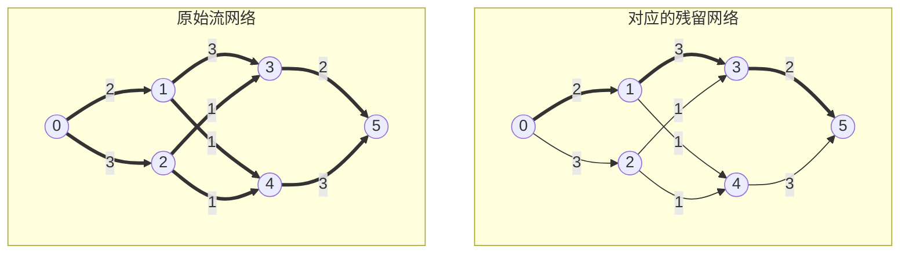

例子

```mermaid
graph TD
subgraph 对应的残留网络
b0((0))== 2 ==>b1((1));
b0((0))-- 3 -->b2((2));
b1((1))== 3 ==>b3((3));
b1((1))-- 1 -->b4((4));
b2((2))-- 1 -->b4((4));
b2((2))-- 1 -->b3((3));
b3((3))== 2 ==>b5((5));
b4((4))-- 3 -->b5((5));
end
subgraph 原始流网络
a0((0))== 2 ==>a1((1));
a0((0))== 3 ==>a2((2));
a1((1))== 3 ==>a3((3));
a1((1))== 1 ==>a4((4));
a2((2))== 1 ==>a4((4));
a2((2))== 1 ==>a3((3));
a3((3))== 2 ==>a5((5));
a4((4))== 3 ==>a5((5));
end
```

第一步，找到增广路径，v0->v1->v3->v5

```mermaid
graph TD
subgraph 对应的残留网络
b0((0))== 2 ==>b1((1));
b0((0))-- 3 -->b2((2));
b1((1))== 3 ==>b3((3));
b1((1))-- 1 -->b4((4));
b2((2))-- 1 -->b4((4));
b2((2))-- 1 -->b3((3));
b3((3))== 2 ==>b5((5));
b4((4))-- 3 -->b5((5));
end
subgraph 原始流网络
a0((0))== 2 ==>a1((1));
a0((0))== 3 ==>a2((2));
a1((1))== 3 ==>a3((3));
a1((1))== 1 ==>a4((4));
a2((2))== 1 ==>a4((4));
a2((2))== 1 ==>a3((3));
a3((3))== 2 ==>a5((5));
a4((4))== 3 ==>a5((5));
end
```

